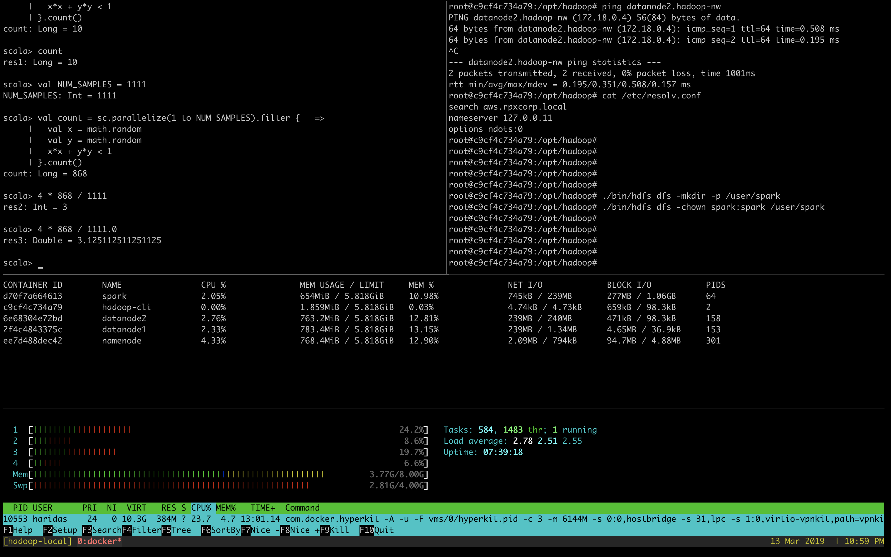

:toc:
:numbered:


= Apache Spark

Spark is a general purpose distributed analytic engine.

Spark can execute tasks in DAG with lazy evaluation for better query
optimization.


== Spark cluster modes

Spark can be deployed in cluster form to execute tasks across multiple machines. 

For this workshop we are covering the *Spark over Yarn* setup. Which
is more scalable and has more cluster management options provided
by Yarn resource manager.

===== Standalone cluster
Run spark cluster without hadoop or any of the bellow mentioned
cluster managers. Spark shipped with this Standalone default
cluster manager. We can easily setup a spark cluster using this.

Here we aren't covering it, Yarn based cluster manager has more
advanced features and resource controllers. We are focusing mainly
Yarn based cluster manager here.

===== Spark on Yarn
This document discuss more about how we handle the spark on Yarn
clster. Please read futher to see more on it.

===== Spark on Kubernetes
We will cover this on 4'th session of Bigdata workshop.

===== Spark on Mesos
Mesos is another cluster resource manager like Yarn, we aren't
covering more on it here.


== Setup Spark on Yarn


=== Setup Hadoop cluster

NOTE: Mac and Windows users has to provide enough memory and cpus to the docker
daemon. On these machines the docker daemon runs under a virtual machine; the installer
setup all these. The default size gives is around 2 cpu core and 2gb. Ensure you provision
at least 5GB RAM and 3Core CPU for docker daemon to play around with bellow experiments.

We already covered this part, in our session 1. Lets add some extra
memory constraints when launching the nodes to get more idea on how
yarn manages the resources. Here we are exposing the required ports
to host machine to see the Web interfaces of RN and HDFS.


```bash

# Launch namenode with 2 core cpu, 2gb memory.
#
docker run -it -d --name namenode \
    -p 8088:8088 \
    -p 50070:50070 \
    --memory 2g --cpus 2
    --network hadoop-nw haridasn/hadoop-2.8.5 namenode
#
# 8088 - RN web interface
# 50070 - HDFS web interface.
#

#
# Datanode 1, 2

docker run -it -d --name datanode1 \
    --memory 2g --cpus 2 \
    --network hadoop-nw haridasn/hadoop-2.8.5 datanode <namenode-ip>

docker run -it -d --name datanode2 \
    --memory 2g --cpus 2 \
    --network hadoop-nw haridasn/hadoop-2.8.5 datanode <namenode-ip>

```

Check the container memory allocation status using `docker stats` command.

=== Create a client docker container

```bash
docker run -it -d --name hadoop-cli --network hadoop-nw haridasn/hadoop-cli

# Add the hadoop configuration to hadoop-client container.
# You can skip this if you already done this.
docker cp namenode:/opt/hadoop/etc .
docker cp etc hadoop-cli:/opt/hadoop/
```

=== Run Spark Container

```bash
docker pull haridasn/spark-2.4.0

docker run -it -d --name spark --network hadoop-nw haridasn/spark-2.4.0
```


=== Connect spark with Yarn

```bash

# Get the hadoop configurations.
docker cp namenode:/opt/hadoop/etc .

docker cp etc/hadoop spark:/opt/spark/hadoop-conf
```

=== Create spark user dir in HDFS

When connecting spark with YARN, you need a staging directory to manage the application
details on the HDFS. The variable which manages this is `spark.yarn.stagingDir`.

Create a directory under hdfs using the `hadoop-cli` hadoop client and ensure it got
correct directory permissions.

```
docker exec -it hadoop-cli bash
./bin/hdfs dfs -mkdir /user/spark
./bin/hdfs dfs -chown spark:spark /user/spark
./bin/hdfs dfs -ls /user/spark
```

=== Lets play on spark

```
# Connect to the spark container to play with it.
docker exec -it spark bash

# Inside the spark docker 
#
export HADOOP_CONF_DIR=/opt/hadoop-conf

# Try on scala client.
spark-shell --master yarn --deploy-mode client

# Try on python client.
pyspark --master yarn --deploy-mode client


# connect via jupyter notebok, so we can use python to write
# spark jobs via pyspark.
jupyter notebook --no-browser --ip=0.0.0.0 --port 8090
```

NOTE: Checkout the command line options `pyspark --help` to know more options
that we can try when submitting the jobs or running as client mode.


=== View the full cluster health

As we are running all the services via docker ensure that the containers are getting
enough resources so that we can play with spark using some smaller size data set to 
under stand how the APIs and other features works in spark.

```bash
# To get the ideas about container resource consumption CPU/RAM/IO
# Ensure you have enough left.
docker stats
```

Test setup is worked well on:-

```text
Test cluster setup on my laptop with 4 core CPU and 8GB memory.

Allocated

    5GB for docker daemon running on your laptop.
    3 Core for docker daemon on your laptop.
```

My Setup:-



=== Submit jobs into spark cluster

Try more examples from this link: https://spark.apache.org/examples.html

== Spark with Cloud Storages

=== spark-shell connected with s3

Spark version: `2.4.0`, Hadoop version works from 2.7+, ensure the
loaded packages and jars doesn't have different versions on the 


```bash

export AWS_ACCESS_KEY=
export AWS_SECRET_KEY=

./bin/spark-shell --packages=org.apache.hadoop:hadoop-aws:1.7.3 \


spark> import com.amazonaws.auth._
spark> val envReader = new EnvironmentVariableCredentialsProvider()
scala> spark.sparkContext.hadoopConfiguration.set("fs.s3a.impl", "org.apache.hadoop.fs.s3a.S3AFileSystem")
scala> spark.sparkContext.hadoopConfiguration.set("fs.s3a.access.key", envReader.getCredentials().getAWSAccessKeyId)
scala> spark.sparkContext.hadoopConfiguration.set("fs.s3a.secret.key", envReader.getCredentials().getAWSSecretKey)

```

== Next: Apache spark vs Apache Drill
